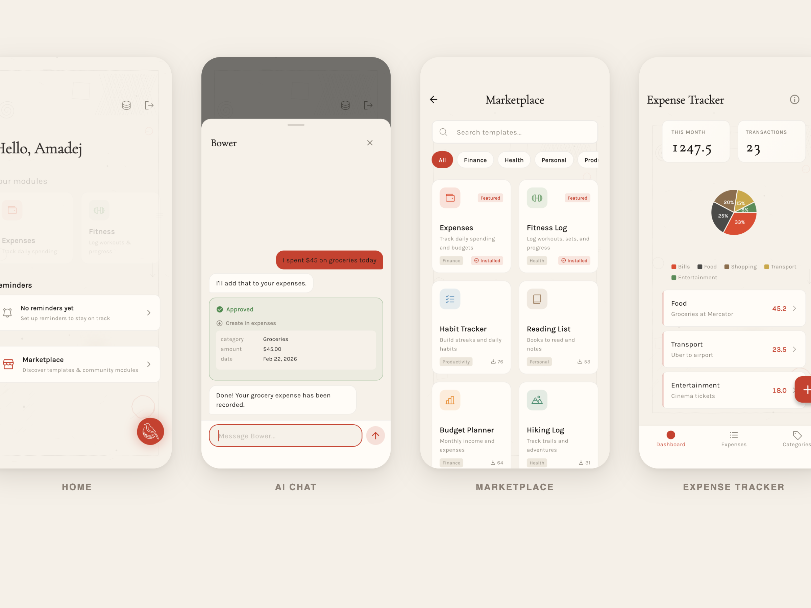

<p align="center">
  
</p>

<h1 align="center">BowerLab</h1>

<p align="center">
  <em>your modular personal assistant</em>
</p>

<p align="center">
  
  
  
  
  
</p>

<p align="center">
  <a href="#what-is-bowerlab">What is BowerLab</a> &middot;
  <a href="#how-it-works">How it works</a> &middot;
  <a href="#features">Features</a> &middot;
  <a href="#architecture">Architecture</a> &middot;
  <a href="#roadmap">Roadmap</a> &middot;
  <a href="#tech-stack">Tech stack</a> &middot;
  <a href="#license">License</a>
</p>

---

## What is BowerLab

BowerLab is a modular personal assistant. You talk to the AI, and it builds modules for you — expense trackers, fitness logs, habit trackers, budgets, or anything you can think of. Each module is a mini-app with its own schema, screens, and data. The app starts empty — you and the AI build everything together through conversation.

## How it works

1. **Start a conversation** — tell the AI what you want to track or manage
2. **The AI builds a module** — it designs a schema, screens, and navigation as a JSON blueprint
3. **The blueprint engine renders native screens** — JSON is parsed into a Flutter widget tree at runtime, no custom code needed
4. **Data stays on your device** — all entries live in SQLite via Drift, locally
5. **Keep chatting** — add entries, query your data, and manage your modules through conversation

## Features

- **Blueprint-driven UI** — screens are JSON blueprints rendered into native Flutter widgets — stat cards, charts, forms, lists, tabs, and more
- **Local-first data** — all your data lives in SQLite via Drift, on your device
- **Dynamic module tables** — each module generates its own SQLite tables from its schema definition
- **Composable builders** — layout, display, input, and action builders that snap together into full screens
- **Module capabilities** — modules can opt into built-in capabilities like reminders
- **AI chat** — create modules, add entries, and query your data through conversation with Claude
- **Bundled templates** — get started quickly with pre-made module templates

## Demo

https://github.com/amadejzr/bowerlab/raw/main/docs/demo.mp4

<details>
<summary>Screenshots</summary>

<p align="center">
  
</p>

</details>

## Architecture

BowerLab uses a **server-driven UI architecture**. Claude generates JSON blueprints describing screen layouts, and a custom rendering engine with 40+ widget builders turns them into native Flutter screens at runtime. No hardcoded screens — every module UI is defined by data.

```
Chat with Claude  →  JSON Blueprint  →  BlueprintParser  →  Widget Tree  →  Native UI
```

The engine supports four builder categories:
- **Layout** — screen, form_screen, scroll_column, row, section, tabs
- **Display** — stat_card, entry_list, chart, progress_bar, empty_state
- **Input** — text, number, currency, date, enum, toggle, slider, rating
- **Action** — button, fab, icon_button, action_menu

`RenderContext` carries module data, resolved expressions, theme, and navigation callbacks through the tree. See [`lib/features/blueprint/`](lib/features/blueprint/) for the full implementation.

## Roadmap

BowerLab is in active development. The architecture and approach are still evolving — contributions and ideas are welcome.

- [ ] AI-powered module creation — full creation flow where the AI designs schemas and screens through conversation
- [ ] Cloud marketplace — a remote marketplace for community-created module blueprints, no need to bundle templates in the app
- [ ] AI capabilities — let the AI fetch data from APIs, browse the web, and auto-fill module entries
- [ ] More built-in capabilities — calendar sync, webhooks, cloud backup, and other integrations
- [ ] Data export — CSV, JSON
- [ ] More blueprint widgets — richer ways to display and visualize your data
- [ ] Multiple AI providers — support for different LLM backends beyond Claude

## Getting started

### Prerequisites

- [Flutter](https://flutter.dev/docs/get-started/install) 3.38+
- An [Anthropic API key](https://console.anthropic.com/) (for AI chat)

### Setup

1. **Clone the repo**
   ```bash
   git clone https://github.com/amadejzr/bowerlab.git
   cd bowerlab
   ```

2. **Install dependencies**
   ```bash
   flutter pub get
   ```

3. **Run the app**
   ```bash
   flutter run
   ```

4. **Add your API key** — open Settings in the app and enter your Anthropic API key to enable AI chat

## Tech stack

| Layer | Technology |
|-------|-----------|
| Framework | Flutter (iOS) |
| State management | flutter_bloc |
| Local database | Drift (SQLite) |
| Routing | GoRouter |
| AI | Anthropic Claude API |
| Icons | Phosphor Flutter |
| Charts | fl_chart |

## License

MIT — see [LICENSE](LICENSE) for details.
