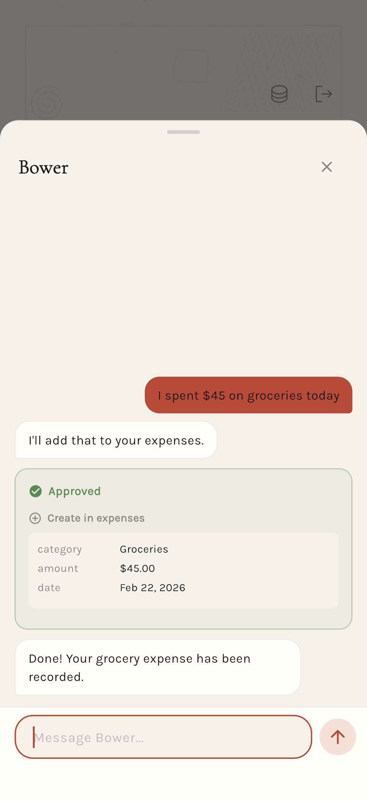

<p align="center">
  
</p>

<h1 align="center">Bower</h1>

<p align="center">
  <em>your personal notebook</em>
</p>

<p align="center">
  
  
  
  
  
</p>

<p align="center">
  <a href="#what-is-bower">What is Bower</a> &middot;
  <a href="#how-it-works">How it works</a> &middot;
  <a href="#features">Features</a> &middot;
  <a href="#tech-stack">Tech stack</a> &middot;
  <a href="#project-structure">Project structure</a> &middot;
  <a href="#license">License</a>
</p>

---

## What is Bower

Bower is a chat-first personal assistant that builds itself as you use it. You talk to the AI, describe what you need — an expense tracker, a fitness log, a habit journal, a budget — and it creates the module for you: schema, screens, and data, all through natural conversation.

The app starts empty. There are no prebuilt templates you're forced into. You and the AI design everything together, one conversation at a time. Each module is a mini-app with its own fields, views, and logic, rendered natively through a server-driven UI system.

## How it works

1. **You describe what you need** — "I want to track my daily expenses with categories and notes"
2. **The AI designs it** — creates a schema (fields, types, constraints) and screen blueprints as JSON
3. **Blueprint renderer builds the UI** — JSON blueprints are parsed into a widget tree and rendered as native Flutter screens
4. **Your data lives locally** — entries are stored in SQLite via Drift, on your device

The AI doesn't just answer questions — it acts on your behalf. It creates modules, adds fields, modifies layouts, and manages your data. You stay in the chat; the app changes around you.

## Features

- **Natural language module creation** — describe what you want, the AI builds it
- **Server-driven UI** — screens are JSON blueprints rendered into native Flutter widgets (cards, charts, forms, lists, tabs)
- **Local-first data** — all your data in SQLite via Drift, no cloud dependency for storage
- **Blueprint system** — layout, display, input, and action builders that compose into full screens
- **Module marketplace** — browse and install pre-made module templates
- **Reminders & notifications** — built-in capabilities that any module can use
- **Sumi ink aesthetic** — hand-crafted design language inspired by Japanese stationery, washi paper textures, and hanko seals

## Screenshots

> Coming soon — screenshots of the login screen, chat interface, module viewer, and splash animation.

<!--
<p align="center">
  
  
  
  
</p>
-->

## Tech stack

| Layer | Technology |
|-------|-----------|
| Framework | Flutter (iOS + Android) |
| State management | flutter_bloc |
| Local database | Drift (SQLite) |
| Routing | GoRouter |
| AI | Anthropic Claude API |
| Icons | Phosphor Flutter |
| Charts | fl_chart |

## Project structure

```
lib/
  main.dart                          # Entry point
  app.dart                           # MaterialApp.router setup
  app_router.dart                    # GoRouter config, auth redirects

  core/
    database/                        # Drift database, tables, converters
    models/                          # Module, Entry, ModuleTemplate
    repositories/                    # Abstract + Drift repos
    theme/                           # AppColors, AppTypography, AppTheme
    widgets/                         # Shared widgets

  features/
    auth/                            # Login, signup, social sign-in
    blueprint/                       # Server-driven UI rendering engine
      builders/                      #   action, display, input, layout
      engine/                        #   Expression evaluator, form validator
      renderer/                      #   BlueprintRenderer, WidgetRegistry
    capabilities/                    # Reminders, notifications
    chat/                            # Chat with Claude
    marketplace/                     # Module template marketplace
    modules/                         # Module system (schema, viewer)
    shell/                           # App frame, navigation, splash
```

## License

MIT — see [LICENSE](LICENSE) for details.
